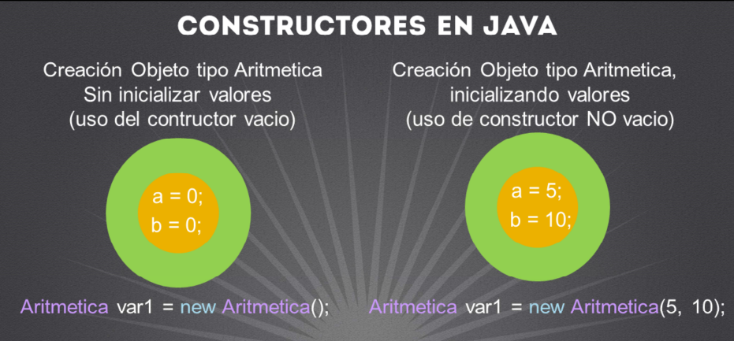

# Constructores

- Constructores en Java
  
  

Puede ser muy tedioso estar inicializando las variables de una clase cada vez que creamos un objeto, para ello Java permite agregar valores a los objetos desde el mismo momento de su creación. A este concepto se le conoce como Constructor, y básicamente **es un método pero que nos permitirá crear un objeto con los valores que proporcionemos al momento de crear 
nuestro objeto**.

Los constructores aunque *son muy similares a los métodos*, tienen ciertas diferencias y características, tales como:

• Estos métodos sólo se puede ejecutar al momento de la creación de un objeto, no es posible utilizarlos después.

• No devuelven ningún valor.

• El nombre del constructor es idéntico al nombre de la clase, así es como podemos identificar si una clase tiene constructores (siempre respetando las mayúsculas y minúsculas).

• Por defecto en Java, se crea un constructor sin argumentos, conocido como constructor vacío. Este constructor lo agrega en automático el compilador de Java a nuestra clase, sin embargo si nosotros definimos un constructor distinto al constructor vacío, es decir, con argumentos, entonces Java ya no agrega el constructor vacío y es nuestra responsabilidad agregar el  constructor vacio a nuestra clase si fuera necesario.

• El constructor vacio es necesario para crear un objeto, recordemos la sintaxis básica general para crear un objeto.
``` Java
 TipoClase objeto = new TipoClase( );
```

Si observamos al final de la línea de código estamos abriendo y cerrando paréntesis, ese es precisamente el constructor vacío que el compilador agregó por nosotros siempre y cuando no agreguemos constructores con otros argumentos. 

Por lo que ahora ya podemos entender que después de la palabra new realmente lo que estamos colocando es el nombre del constructor que deseamos llamar,  tener argumentos o no.

En la figura podemos observar un ejemplo de nuestra clase Aritmetica, usando un constructor vacio y otro no vacio para crear nuestros objetos.

Supongamos que tenemos dos atributos en nuestra clase, de tipo entero, llamado a y b. 
En el primer caso estamos creando un objeto llamando al constructor vacío, por lo tanto los valores de nuestros atributos se inicializan con los valores por default según el tipo de cada atributo. 

``` Java
 Aritmetica = new Aritmetica();
```
**Si es un tipo primitivo, se inicializan según su valor por default, y si son de tipo object su valor inicia es null.**

Por otro lado creamos un objeto Aritmetica pero con valores iniciales desde el momento en que estamos creando el objeto respectivo. Estamos enviando los valores de 5 y 10 respectivamente, y por lo tanto podemos tomar estos valores para inicializar 

``` Java
 Aritmetica = new Aritmetica(5,10);
```
## Llamando un método
- Llamada general de un metodo en Java
``` Java
// Creando un objeto de la clase a llamar su método 
  TipoClase objecto = new TipoClase();

  /*Llamamos el método, enviando argumentos si requieren.
    si el método regresa un valor podemos recibirlo según el tipo
  */
  tipoDevuelto resultado = objecto.nombreMetodo(arg1,arg2,arg3);
```
- Ejemplo de llamada a un método en Java:
```Java
  //Creamos un objeto de la clase Aritmetica
  Aritmetica objecto1 = new Aritmetica();

  // llamos el metodo sumar y recibimos el valor devuelto.
  int resultado = objecto1.sumar(78,48);
```

Una vez que hemos agregado un método a una clase, podemos hacer uso de él haciendo lo siguiente:

1) Debemos declarar un objeto del tipo de la clase que tiene el método que nos interesa utilizar.
   
2) Por medio del objeto declarado, utilizamos el operador punto (.) y posterior a este operador escribimos el nombre del método que nos interesa llamar. 

3) Posterior del nombre del método, abrimos y cerramos paréntesis. Si el método no recibe ningún argumento, solo abrimos y cerramos paréntesis, sin embargo si el método fue escrito para recibir argumentos, debemos proporcionar los argumentos del tipo esperado, separando por comas cada uno de ellos.
   
5) Finalmente, si el método fue escrito para regresar un valor, es opcional el recibirlo con una variable del tipo que regresa el método. Debemos notar que el tipo devuelto por un método no tiene que ser igual a los tipos de los argumentos recibidos. Para ello debemos observar la firma del método que vayamos a utilizar. 

Si recordamos, la firma del método sumar sería: 
```Java
int sumar(int, int); //firma del método
```
Por lo que observamos que el método recibo dos argumentos de tipo entero, pero podría ser cualquier otro tipo, se llama sumar y devuelve un tipo entero, pero también podría ser cualquier otro tipo.